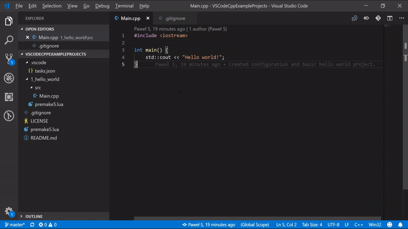

# VSCodeCppExampleProjects
Example C++ projects written using [Visual Studio Code](https://code.visualstudio.com/) with [Premake5](https://github.com/premake/premake-core/wiki) build system.

Advantages of this approach:
- Ability to build your code wherever you want with whatever tool (limited to compilers supported by Premake5)
- Automated build system with VS Code tasks.

## What you should know?

This repository contains example projects designed for newbies to learn how to properly develop C++ applications without being concerned about whether your code will compile on Windows, Linux or other platform. **Keep in mind that we are still limited to what Premake5 supports and that you still have to write your code in such way that it will actually compile.**

Visual Studio Code can easily become very good IDE, if you properly setup it.
Take a look at [tasks.json](.vscode/tasks.json) file to learn how to write and use various tasks.
Use `Ctrl+Shift+P` in VS Code to open command window, then type and select `Run build task`.
Pick one of the configured build actions (`Re/build (VS2017/GCC)`) and then select platform and configuration from dropdown list.

- You have to have C++ compiler installed (either g++ or MS Visual Studio C++)
- You have to have Premake5 installed and added to system `PATH` environment variable.

## How does it work?

Entire workspace settings are located in [premake5.lua](premake5.lua) script. This file also includes every project build script (each is located at `project_name/premake5.lua`). Read comments in build scripts.

## Last words

I really recommend development in VS Code with Premake5. It is easy, robust and practical. Wish you easy learning.